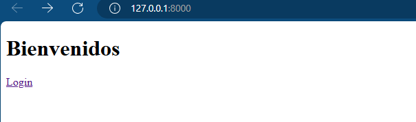

# Proyecto Inmobiliario

Este proyecto tiene como finalidad crear las funcionalidades de una pagina web de arriendo y venta de inmuebles. Estas funcionalidades son las siguientes:

- Página para hacer Login y Logout
- Página para crear usuario
- Página para actualizar datos de usuario
- Página para crear una propiedad
- Página para listar inmuebles

A continuación se dejan capturas de las paginas base creadas:

